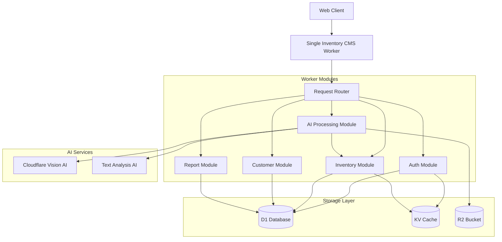
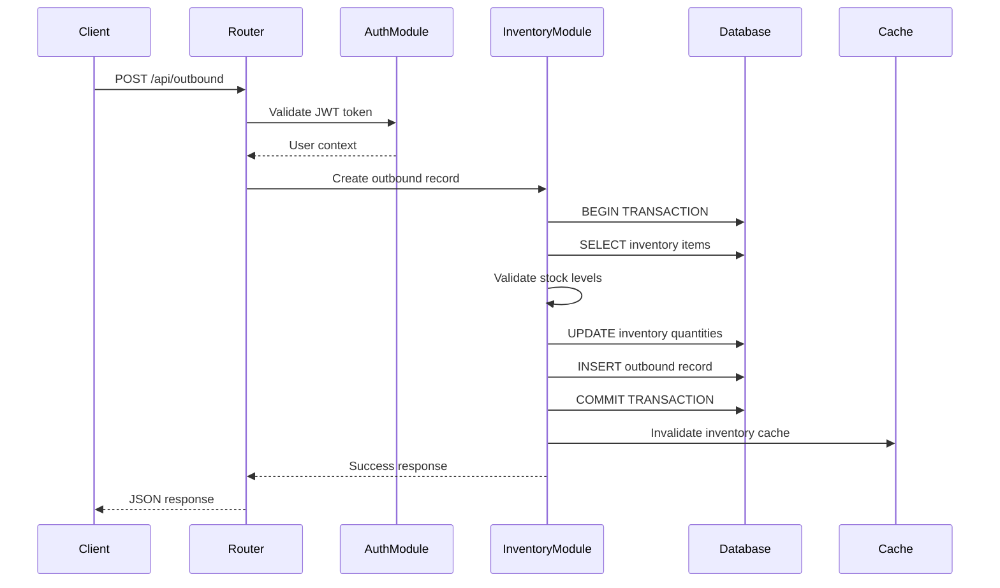
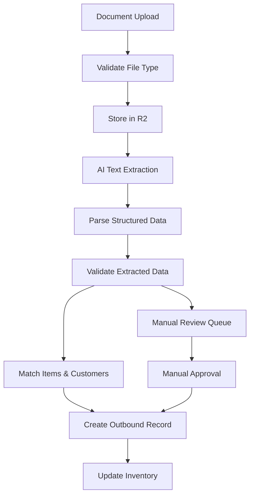
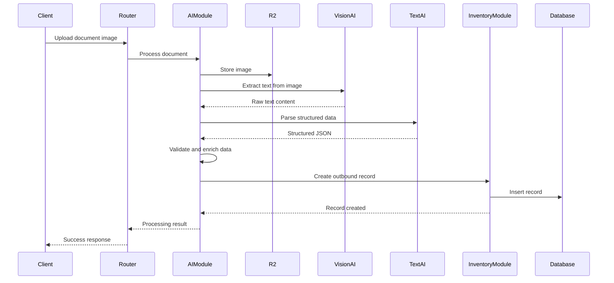
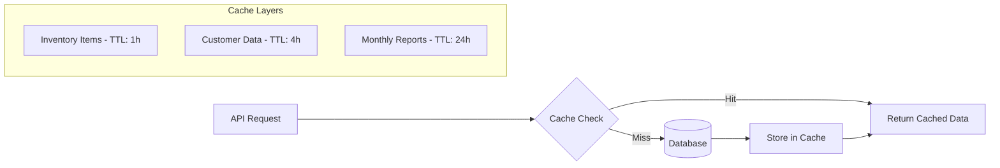

# Inventory Management System Design

## Overview

This document describes the design for a minimal CMS built on Cloudflare Workers that includes inventory management capabilities and AI-powered image recognition for automated data entry. The system extends the existing easy-cms architecture to support inventory tracking, customer management, and intelligent document processing.

### Core Features
- **Simple Authentication**: JWT-based login system with session management
- **Inventory Management**: Track stock levels, outbound shipments, and customer information
- **Monthly Reporting**: Automated monthly outbound shipment summaries
- **AI-Powered Document Processing**: Use Cloudflare Workers AI to process shipping documents via image upload and extract shipment data automatically

### Technology Stack
- **Runtime**: Cloudflare Workers
- **Storage**: Cloudflare D1 (SQLite-compatible database)
- **Caching**: Cloudflare KV
- **File Storage**: Cloudflare R2 (for document images)
- **AI Processing**: Cloudflare Workers AI (Vision and Text models)
- **Authentication**: JWT tokens with session management

## Architecture

The system uses a monorepo approach with a single Cloudflare Worker handling all functionality. This simplifies deployment, reduces latency between components, and maintains the serverless edge computing benefits.



### Monorepo Structure

```
src/
├── index.ts                 # Main worker entry point
├── router/
│   └── routes.ts           # Request routing logic
├── modules/
│   ├── auth/
│   │   ├── auth.service.ts
│   │   └── session.service.ts
│   ├── inventory/
│   │   ├── inventory.service.ts
│   │   └── stock.service.ts
│   ├── customer/
│   │   └── customer.service.ts
│   ├── ai/
│   │   ├── document-processor.ts
│   │   └── text-extractor.ts
│   └── reports/
│       └── monthly-reports.service.ts
├── shared/
│   ├── types.ts
│   ├── utils.ts
│   ├── database.ts
│   └── constants.ts
└── middleware/
    ├── auth.middleware.ts
    ├── validation.middleware.ts
    └── error.middleware.ts
```

### Module Components

#### 1. Authentication Module (`modules/auth/`)
Handles user authentication and session management:
- JWT token generation and validation
- Session management with KV storage
- Role-based access control

#### 2. Inventory Module (`modules/inventory/`)  
Core business logic for inventory operations:
- Stock level tracking
- Outbound shipment recording
- Inventory movement validation
- Atomic stock updates

#### 3. Customer Module (`modules/customer/`)
Customer information management:
- Customer CRUD operations
- Customer data validation
- Search and filtering

#### 4. AI Processing Module (`modules/ai/`)
Processes uploaded shipping documents:
- Image analysis and text extraction
- Structured data parsing
- Integration with inventory system
- Confidence scoring and validation

#### 5. Reports Module (`modules/reports/`)
Generates business reports:
- Monthly outbound summaries
- Dashboard metrics
- Data aggregation and analysis

## Data Models

### User Model
```typescript
interface User {
  id: string;
  username: string;
  passwordHash: string;
  role: 'admin' | 'operator';
  createdAt: Date;
  lastLogin?: Date;
}
```

### Inventory Item Model
```typescript
interface InventoryItem {
  id: string;
  name: string;
  sku: string;
  description?: string;
  currentStock: number;
  unitPrice: number;
  createdAt: Date;
  updatedAt: Date;
}
```

### Customer Model
```typescript
interface Customer {
  id: string;
  name: string;
  company?: string;
  email?: string;
  phone?: string;
  address?: string;
  createdAt: Date;
  updatedAt: Date;
}
```

### Outbound Record Model
```typescript
interface OutboundRecord {
  id: string;
  customerId: string;
  items: OutboundItem[];
  totalAmount: number;
  shipmentDate: Date;
  documentImageUrl?: string;
  status: 'pending' | 'shipped' | 'delivered';
  createdAt: Date;
  createdBy: string;
  extractedData?: ExtractedShipmentData;
}

interface OutboundItem {
  inventoryItemId: string;
  quantity: number;
  unitPrice: number;
  totalPrice: number;
}
```

### Monthly Summary Model
```typescript
interface MonthlySummary {
  id: string;
  year: number;
  month: number;
  totalShipments: number;
  totalRevenue: number;
  topCustomers: CustomerSummary[];
  topItems: ItemSummary[];
  generatedAt: Date;
}
```

## API Endpoints Reference

### Authentication Endpoints

| Method | Endpoint | Description | Auth Required |
|--------|----------|-------------|---------------|
| POST | `/auth/login` | User login | No |
| POST | `/auth/logout` | User logout | Yes |
| GET | `/auth/me` | Get current user info | Yes |

### Inventory Management Endpoints

| Method | Endpoint | Description | Auth Required |
|--------|----------|-------------|---------------|
| GET | `/api/inventory` | List inventory items | Yes |
| POST | `/api/inventory` | Create inventory item | Yes |
| PUT | `/api/inventory/:id` | Update inventory item | Yes |
| DELETE | `/api/inventory/:id` | Delete inventory item | Yes |
| GET | `/api/inventory/:id/stock` | Get stock level | Yes |
| PUT | `/api/inventory/:id/stock` | Update stock level | Yes |

### Customer Management Endpoints

| Method | Endpoint | Description | Auth Required |
|--------|----------|-------------|---------------|
| GET | `/api/customers` | List customers | Yes |
| POST | `/api/customers` | Create customer | Yes |
| PUT | `/api/customers/:id` | Update customer | Yes |
| DELETE | `/api/customers/:id` | Delete customer | Yes |

### Outbound Records Endpoints

| Method | Endpoint | Description | Auth Required |
|--------|----------|-------------|---------------|
| GET | `/api/outbound` | List outbound records | Yes |
| POST | `/api/outbound` | Create outbound record | Yes |
| PUT | `/api/outbound/:id` | Update outbound record | Yes |
| DELETE | `/api/outbound/:id` | Delete outbound record | Yes |
| POST | `/api/outbound/upload` | Upload and process document | Yes |

### Reporting Endpoints

| Method | Endpoint | Description | Auth Required |
|--------|----------|-------------|---------------|
| GET | `/api/reports/monthly/:year/:month` | Get monthly summary | Yes |
| POST | `/api/reports/generate/:year/:month` | Generate monthly report | Yes |
| GET | `/api/reports/dashboard` | Get dashboard metrics | Yes |

## Business Logic Layer

### Single Worker Request Flow

All functionality is handled within a single worker, with modular services for different concerns:



### Module Interactions

Since all modules exist within the same worker context, they can directly import and call each other:

```typescript
// Example of module interaction within single worker
import { validateSession } from './modules/auth/session.service';
import { updateInventory } from './modules/inventory/inventory.service';
import { processDocument } from './modules/ai/document-processor';

export async function handleOutboundUpload(request: Request, env: Env) {
  // Authentication
  const user = await validateSession(request, env);
  
  // AI Processing
  const extractedData = await processDocument(uploadedImage, env);
  
  // Inventory Update
  const result = await updateInventory(extractedData, user.id, env);
  
  return new Response(JSON.stringify(result));
}
```

#### Key Operations:
- **Stock Validation**: Ensure sufficient inventory before creating outbound records
- **Atomic Updates**: Use database transactions for inventory adjustments
- **Cache Management**: Invalidate relevant cache entries on inventory changes
- **Audit Trail**: Maintain complete history of all inventory movements

### AI Document Processing Module

The AI module processes uploaded shipping documents and extracts structured data within the same worker context:



#### AI Processing Pipeline:
1. **File Validation**: Check file type, size, and format
2. **Image Storage**: Store document image in R2 bucket
3. **Text Extraction**: Use Cloudflare Vision AI to extract text from image
4. **Data Parsing**: Apply pattern matching to identify key information
5. **Validation**: Verify extracted data against business rules
6. **Entity Matching**: Match customer names and item descriptions to existing records
7. **Record Creation**: Generate outbound record from extracted data using inventory module

#### Module Integration Example:
```typescript
// AI module calling inventory module directly
import { createOutboundRecord } from '../inventory/inventory.service';
import { findCustomerByName } from '../customer/customer.service';

export async function processShippingDocument(imageData: ArrayBuffer, env: Env) {
  // Extract text using AI
  const extractedText = await extractTextFromImage(imageData, env);
  
  // Parse structured data
  const parsedData = await parseShippingData(extractedText, env);
  
  // Match customer
  const customer = await findCustomerByName(parsedData.customerName, env);
  
  // Create outbound record via inventory module
  const record = await createOutboundRecord({
    customerId: customer.id,
    items: parsedData.items,
    extractedData: parsedData
  }, env);
  
  return record;
}
```

### Monthly Reporting Service

Automated generation of monthly summaries with key metrics:

#### Report Components:
- Total number of shipments
- Total revenue generated
- Top customers by volume/revenue
- Most shipped items
- Inventory movement analysis
- Period-over-period comparisons

## Authentication and Authorization

### JWT Token Structure
```typescript
interface JWTPayload {
  userId: string;
  username: string;
  role: 'admin' | 'operator';
  iat: number;
  exp: number;
}
```

### Role-Based Access Control

| Resource | Admin | Operator |
|----------|-------|----------|
| User Management | Read/Write | None |
| Inventory Management | Read/Write | Read/Write |
| Customer Management | Read/Write | Read/Write |
| Outbound Records | Read/Write | Read/Write |
| Monthly Reports | Read/Write | Read Only |
| System Settings | Read/Write | None |

### Session Management
- Sessions stored in Cloudflare KV with 24-hour TTL
- IP address validation for enhanced security
- Automatic session cleanup for expired tokens

## Database Schema

### Tables Structure

```sql
-- Users table
CREATE TABLE users (
  id TEXT PRIMARY KEY,
  username TEXT UNIQUE NOT NULL,
  password_hash TEXT NOT NULL,
  role TEXT NOT NULL CHECK (role IN ('admin', 'operator')),
  created_at DATETIME DEFAULT CURRENT_TIMESTAMP,
  last_login DATETIME
);

-- Inventory items table
CREATE TABLE inventory_items (
  id TEXT PRIMARY KEY,
  name TEXT NOT NULL,
  sku TEXT UNIQUE NOT NULL,
  description TEXT,
  current_stock INTEGER NOT NULL DEFAULT 0,
  unit_price REAL NOT NULL,
  created_at DATETIME DEFAULT CURRENT_TIMESTAMP,
  updated_at DATETIME DEFAULT CURRENT_TIMESTAMP
);

-- Customers table  
CREATE TABLE customers (
  id TEXT PRIMARY KEY,
  name TEXT NOT NULL,
  company TEXT,
  email TEXT,
  phone TEXT,
  address TEXT,
  created_at DATETIME DEFAULT CURRENT_TIMESTAMP,
  updated_at DATETIME DEFAULT CURRENT_TIMESTAMP
);

-- Outbound records table
CREATE TABLE outbound_records (
  id TEXT PRIMARY KEY,
  customer_id TEXT NOT NULL REFERENCES customers(id),
  total_amount REAL NOT NULL,
  shipment_date DATE NOT NULL,
  document_image_url TEXT,
  status TEXT NOT NULL CHECK (status IN ('pending', 'shipped', 'delivered')),
  created_at DATETIME DEFAULT CURRENT_TIMESTAMP,
  created_by TEXT NOT NULL REFERENCES users(id),
  extracted_data TEXT -- JSON field for AI extracted data
);

-- Outbound items table
CREATE TABLE outbound_items (
  id TEXT PRIMARY KEY,
  outbound_record_id TEXT NOT NULL REFERENCES outbound_records(id),
  inventory_item_id TEXT NOT NULL REFERENCES inventory_items(id),
  quantity INTEGER NOT NULL,
  unit_price REAL NOT NULL,
  total_price REAL NOT NULL
);

-- Monthly summaries table
CREATE TABLE monthly_summaries (
  id TEXT PRIMARY KEY,
  year INTEGER NOT NULL,
  month INTEGER NOT NULL,
  total_shipments INTEGER NOT NULL,
  total_revenue REAL NOT NULL,
  top_customers TEXT, -- JSON field
  top_items TEXT, -- JSON field
  generated_at DATETIME DEFAULT CURRENT_TIMESTAMP,
  UNIQUE(year, month)
);
```

### Indexes
```sql
CREATE INDEX idx_outbound_records_customer_id ON outbound_records(customer_id);
CREATE INDEX idx_outbound_records_shipment_date ON outbound_records(shipment_date);
CREATE INDEX idx_outbound_items_outbound_record_id ON outbound_items(outbound_record_id);
CREATE INDEX idx_outbound_items_inventory_item_id ON outbound_items(inventory_item_id);
CREATE INDEX idx_inventory_items_sku ON inventory_items(sku);
```

## AI Integration Architecture

### Cloudflare Workers AI Integration

The system integrates AI capabilities directly within the single worker, eliminating the need for inter-service communication:



### Single Worker AI Processing

All AI operations happen within the same execution context, providing:
- **Reduced Latency**: No network calls between services
- **Simplified Error Handling**: Single error boundary for the entire flow
- **Shared Context**: Access to the same request context and environment variables
- **Atomic Operations**: Database transactions can span AI processing and data storage

#### AI Module Structure:
```typescript
// src/modules/ai/document-processor.ts
export class DocumentProcessor {
  constructor(private env: Env) {}
  
  async processDocument(imageData: ArrayBuffer): Promise<ProcessingResult> {
    // All AI operations within same worker context
    const textContent = await this.extractText(imageData);
    const structuredData = await this.parseData(textContent);
    const validatedData = await this.validateData(structuredData);
    
    return {
      extractedData: validatedData,
      confidence: this.calculateConfidence(validatedData),
      requiresReview: this.shouldReview(validatedData)
    };
  }
  
  private async extractText(imageData: ArrayBuffer): Promise<string> {
    return await this.env.AI.run('@cf/microsoft/resnet-50', {
      image: [...new Uint8Array(imageData)]
    });
  }
  
  private async parseData(text: string): Promise<ExtractedShipmentData> {
    const response = await this.env.AI.run('@cf/meta/llama-2-7b-chat-int8', {
      prompt: `Extract shipping information from: ${text}`
    });
    
    return JSON.parse(response.response);
  }
}
```

### AI Models Used

#### 1. Vision Model (Text Extraction)
- **Model**: `@cf/microsoft/resnet-50` or `@cf/meta/llama-2-7b-chat-int8`
- **Purpose**: Extract text content from shipping document images
- **Input**: Image file (JPEG/PNG)
- **Output**: Raw text content

#### 2. Text Analysis Model (Data Parsing)  
- **Model**: `@cf/meta/llama-2-7b-chat-int8`
- **Purpose**: Parse extracted text into structured data
- **Input**: Raw text + parsing instructions
- **Output**: Structured JSON with shipment details

### Data Extraction Patterns

The AI service uses predefined patterns to extract key information:

```typescript
interface ExtractedShipmentData {
  customerName?: string;
  shipmentDate?: string;
  items: ExtractedItem[];
  totalAmount?: number;
  confidence: number;
  rawText: string;
}

interface ExtractedItem {
  description: string;
  quantity?: number;
  unitPrice?: number;
  totalPrice?: number;
  confidence: number;
}
```

### Validation and Quality Control

#### Confidence Scoring
- Each extracted field includes a confidence score (0-1)
- Records with low confidence scores are flagged for manual review
- Threshold: 0.7 for automatic processing, 0.4+ for manual review queue

#### Fallback Strategies
- If AI extraction fails, fall back to manual data entry
- Partial extraction results are saved for human verification
- Learning from manual corrections to improve future extraction

## Performance Optimization

### Caching Strategy



#### Cache Configuration
- **Inventory Items**: 1-hour TTL (frequent updates)
- **Customer Data**: 4-hour TTL (moderate updates)
- **Monthly Reports**: 24-hour TTL (static after generation)
- **Session Data**: 24-hour TTL with sliding expiration

### Database Optimization

#### Query Optimization
- Use prepared statements for frequent queries
- Implement pagination for large result sets
- Create composite indexes for common query patterns
- Use connection pooling for database efficiency

#### Bulk Operations
- Batch inventory updates during outbound record creation
- Use database transactions for multi-table operations
- Implement bulk import capabilities for initial data migration

### Edge Computing Benefits
- Global distribution via Cloudflare's edge network
- Sub-100ms response times worldwide
- Automatic scaling based on demand
- Built-in DDoS protection and security

### Single Worker Architecture Benefits
- **Simplified Deployment**: Single deployable unit with all functionality
- **Reduced Cold Starts**: Only one worker needs to initialize
- **Lower Latency**: No inter-service communication overhead
- **Easier Debugging**: Single execution context for request tracing
- **Shared Resources**: Efficient use of memory and CPU within worker limits
- **Atomic Transactions**: Database operations can span multiple modules
- **Simplified Configuration**: Single wrangler.toml for all functionality

## Security Considerations

### Data Protection
- All sensitive data encrypted at rest in D1 database
- JWT tokens signed with rotating secrets
- Image uploads validated for file type and size
- Input sanitization for all user-provided data

### Access Control
- Role-based permissions enforced at API level
- Rate limiting to prevent abuse
- Session validation on every request
- Audit logging for all data modifications

### AI Security
- Uploaded images scanned for malicious content
- AI model outputs validated before database insertion
- Extracted data sanitized to prevent injection attacks
- Confidence thresholds to prevent false positives

## Testing Strategy

### Unit Testing
- **Module Testing**: Individual module function testing with mocked dependencies
- **Service Layer Testing**: Database operation testing with mock data
- **AI Logic Validation**: AI extraction logic validation with sample documents
- **Authentication Testing**: JWT and session management testing
- **Utility Function Testing**: Shared utility and helper function testing

### Integration Testing
- **End-to-End Workflow Testing**: Complete request flows from routing to response
- **Module Integration Testing**: Testing interactions between modules within the worker
- **Database Transaction Testing**: Multi-table operations and rollback scenarios
- **AI Pipeline Integration**: Full document processing pipeline testing
- **Cache Integration Testing**: KV storage and cache invalidation testing

### Worker-Specific Testing
```typescript
// Example test structure for single worker
describe('Inventory CMS Worker', () => {
  let worker: WorkerEntrypoint;
  let env: Env;
  
  beforeEach(() => {
    env = getMockEnv();
    worker = new WorkerEntrypoint();
  });
  
  describe('Authentication Module', () => {
    it('should validate JWT tokens', async () => {
      const request = new Request('https://example.com/api/inventory', {
        headers: { 'Authorization': 'Bearer valid-token' }
      });
      
      const response = await worker.fetch(request, env);
      expect(response.status).toBe(200);
    });
  });
  
  describe('AI Processing Module', () => {
    it('should process shipping documents', async () => {
      const formData = new FormData();
      formData.append('document', mockImageFile);
      
      const request = new Request('https://example.com/api/outbound/upload', {
        method: 'POST',
        body: formData
      });
      
      const response = await worker.fetch(request, env);
      const result = await response.json();
      
      expect(result.extractedData).toBeDefined();
      expect(result.confidence).toBeGreaterThan(0.7);
    });
  });
  
  describe('Module Integration', () => {
    it('should create outbound record from AI extraction', async () => {
      // Test that AI module can call inventory module successfully
      const mockExtractedData = getMockExtractedData();
      const result = await processDocumentAndCreateRecord(mockExtractedData, env);
      
      expect(result.outboundRecord).toBeDefined();
      expect(result.inventoryUpdated).toBe(true);
    });
  });
});
```

### Performance Testing
- **Single Worker Load Testing**: Concurrent request handling within worker limits
- **Memory Usage Monitoring**: Ensure worker stays within Cloudflare's memory limits
- **Database Query Performance**: Optimize queries for single worker access patterns
- **AI Processing Latency**: Measure end-to-end AI processing times
- **Cache Efficiency Testing**: Validate cache hit ratios and performance gains

### Test Data Management
- **Module-Specific Mock Data**: Isolated test data for each module
- **Shared Test Utilities**: Common test helpers for worker testing
- **AI Mock Responses**: Consistent AI responses for predictable testing
- **Database Seeding**: Test data setup for integration scenarios
- **Test Isolation**: Ensure tests don't interfere with each other in single worker context